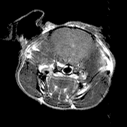
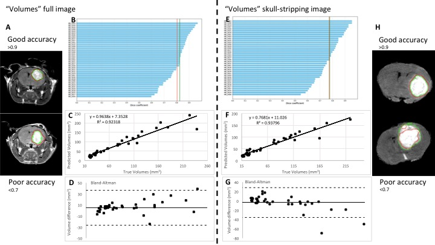

# Deep learning for glioblastoma tumor volume segmentation in mouse

__0.94 DSC (94% accuracy)________________Predicted segmentation_________________Manual segmentation        

.   .     .

## Method
### Mouse glioblastoma model
All procedures and imaging protocols for this study were approved and performed in accordance with Dana-Farber Cancer Institute's Institutional Animal Care and Use Committee (IACUC). For the intercranial injection of the GL261-luc2 cells, 6 to 10-week old female B6(Cg)-Tyrc-2J/J mice (The Jackson Laboratory, Bar Harbor, ME).
### In-vivo MRI imaging data collection  
MRI in vivo studies were performed on a 7T/30 cm USR horizontal bore Superconducting Magnet System 300.3 MHz (Bruker BioSpin MRI, Ettlingen, Germany BioSpec). 
Three MRI sequences were engaged in-vivo on GBM mice: Fluid attenuated inversion recovery (FLAIR), Fast-Spin-Echo T1 and T2 weighted
FLAIR MRI datasets and related segmentation masks have been made public and available in kaggle (https://www.kaggle.com/prot78/deep-learning-gbm-tumor-volume-estimation-in-mouse).
### Data preparation
The dicom files produced by our Bruker MRI scanner had to be converted in 256x256 RGB images. 
1.	“Image segmentation”. The dicom MRI files were upload into our in-house software (named ClinicalVolumes). The software performs image segmentation either in a semi-automatic or manual manner, but for this particular work the use a full manual tumor area segmentation was preferred. Tumor segmentation masks (“tumor mask”) were saved in dicom format and the calculated tumor volumes collected in a text file (named “vol.txt”) together with additional volume segmented information.
For the FLAIR dataset, a manual segmentation was also applied to generate a “brain mask” for skull-stripping segmentation purposes and saved in dicom format. A text file (named “vol_brain.txt”) was generated for each mouse containing brain volume information.   
2.	“8 bits masks”. A MatLab (R2018a (9.4.0) 64-bits) program was used to convert the masks, both for tumor and brain, created in the previous segmentation step, from a dicom format to a 8bits Tiff image 256x256 matrix. 
3.	“RGB images”. A Python 3.7 program was used to generate RGB Tiff 256x256 images from the MRI dicom format datasets.
Instruction sheets in addition to the ClinicalVolumes software and MatLab and Python programs can be downloaded above in the "Data preparation" section.
### Automatic segmentation
A detailed description of the automatic segmentation algorithm and how to run it are given in the work of Buda et al. [Buda M, Saha A, Mazurowski MA. Association of genomic subtypes of lower-grade gliomas with shape features automatically extracted by a deep learning algorithm. Comput Biol Med. 2019;109:218-25]. 
To initialize the training phase, MRI images and related masks fed the CNN U-net model. A minimum of 16 volumes were used. The data were selected homogeneously throughout the tumor volume range and then divided in two groups: small tumor (<15 mm3) and middlesize_to_large tumor (> 15 mm3). In order to achieve reliable and robust “weights” few factors results crucial during the training phase:
•	Good image quality;
•	Good contrast between tumor and healthy tissues;
•	Precise differentiation between tumor volumes groups (small tumor to large tumor);
•	Similar number of slices between datasets;
•	Images must be vertically aligned or tilted within a maximum of 20 degrees angle, any large angular deformation can compromise the training and therefore images must be rotate toward the vertical axis during data preparation.  
Once completed the data training, the calculated “weights” were used in the “inference” part of the code.
Both training and inference original codes undertake small changes in order to best fit with our MRI data and data analysis. Such codes can be found above in the "Code" section.
### Data analysis
The deep learning program calculated the Dice coefficient (DSC) of each animal highlighting the level of similarity and accuracy between manual and automatic segmentation. In addition to the DSC analysis, the segmented areas were further analyzed by comparing the volumes obtained by each animal (“volumes” analysis) and by slice (“slice by slice” area analysis). “Volumes” and “slice by slice” analysis undergo a two-sided P value, test of correlation (Pearson’s coefficient) and agreement (Bland-Altman). P value less than .05 was considered statistically different.

.
 

## Results
Dicom data files, which represent the most common MRI data format, were uploaded in the ClinicalVolume software. This in-house computer software was successfully used to manually segment tumor and brain (skull-stripping) regions. As an output, masks were generated in dicom format and volumes reported in a text file together with other information related to the segmentation. This step was pivotal to then validate the CNN automatic segmentation with the manual ClinicalVolumes approach. The MatLab (8 bits masks) and the Python (RGB images) programs efficiently transformed MRI dicoms in images of a suitable format for automatic segmentation. More than 20 animals were typically segmented for the small and middlesize_to_large group.
Regarding the automatic segmentation, the entire dataset and then the two groups were successfully trained thus generating a series of “weights” specific to each. The “weights” were then used to infer a prediction of the glioblastoma volumes.
A visual and graphical representation of the FLAIR middlesize_to_large group for “volumes” without and with skull-stripping is reported in the figure below. The values expressed by the graphs did not emphasize significant differences between the two cases. In addition, MRI images related to good and poor segmented correlation are shown where the manual segmentation area contour is highlighted in green while the automatic in red color.

.

Figure. FLAIR “Volumes” full image and “Volumes” skull-stripping representation of segmented image and data analysis for the middle_to_large group. A) Example of good and poor accuracy volume image where the true volume contour is highlighted in green and the predicted in red. B), C), D) represent respectively test of accuracy (DSC analysis) of single animal FLAIR volume data; test of correlation (Pearson’s coefficient); test of agreement (Bland-Altman). E), F), G), represent respectively test of accuracy (DSC analysis) of skull-stripping single animal FLAIR volume data; test of correlation (Pearson’s coefficient); test of agreement (Bland-Altman). H) Example of good and poor accuracy skull-stripping volume image.
